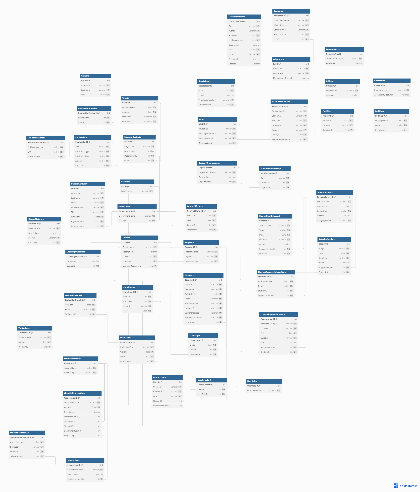

# Academic-Institution-Database-Design
Academic Institution Database, Database Design, Schema

# Introduction and Overview of the database design
My database meets the needs of storing and managing a large amount of data for a famous university in Vietnam.

The university offers undergraduate and graduate programs across numerous departments.
Each department houses a faculty body comprising professors, lecturers, and teaching assistants.
These faculty members conduct a variety of courses, each of which has a set of learning outcomes, a syllabus, and a grading scheme.
Students can enroll in multiple courses per semester and are evaluated based on their performance in assignments, quizzes, exams, and projects.

In addition to teaching, faculty members are actively engaged in research.
They lead research projects, sometimes funded by external grants, and produce publications such as journal articles, conference papers, and books.

The university offers resources such as tutoring services, career counseling, and mental health support.
The university tracks student interactions with these resources to better understand and meet their needs.

The university library offers a vast collection of books, journals, and digital resources, all of which are cataloged and available for students and faculty.

Students can participate in student organizations, clubs and sports teams at the university.

The university's facilities include multiple buildings, classrooms, laboratories, offices, and common areas.

The university manages finances including tuition, scholarships for students and payroll for faculty and staff.
The university keeps detailed records of all financial transactions.

# The Entity Relationship Diagram (ERD)


## The link to a diagram:
### https://dbdiagram.io/d/669905b58b4bb5230eb34266

# Detail Entites Diagram
### The database consists of 45 separate entities to meet the university's database system needs.

```
Table Students {
  StudentID int [pk]
  FirstName varchar [not null]
  LastName varchar [not null]
  DateOfBirth date [not null]
  Email varchar [unique, not null]
  PhoneNumber varchar [not null]
  NationalID varchar [unique, not null]
  CurrentAddress varchar [not null]
  PermanentAddress varchar [not null]
  ProgramID int [ref: > Programs.ProgramID, not null]
}
```

```
Table Faculties {
  FacultyID int [pk]
  FacultyName varchar [not null]
}
```

```
Table Departments {
  DepartmentID int [pk]
  DepartmentName varchar [not null]
  FacultyID int [ref: > Faculties.FacultyID, not null]
}
```

```
Table DepartmentStaff {
  StaffID int [pk]
  FirstName varchar [not null]
  LastName varchar [not null]
  Email varchar [unique, not null]
  PhoneNumber varchar [not null]
  Title varchar [not null]
  PaySalary float [not null]
  PayFrequency varchar [not null]
  DepartmentID int [ref: > Departments.DepartmentID, not null]
}
```

```
Table Programs {
  ProgramID int [pk]
  ProgramName varchar [not null]
  Degree varchar [not null]
  DepartmentID int [ref: > Departments.DepartmentID, not null]
}
```

```
Table Courses {
  CourseID int [pk]
  CourseName varchar [not null]
  Description varchar [null]
  Credits varchar [not null]
  ProgramID int [ref: > Programs.ProgramID, not null]
  LearningOutcomesID int [ref: > LearningOutcomes.LearningOutcomesID, not null]
}
```

```
Table CourseMaterials {
  MaterialID int [pk]
  MaterialType varchar [not null]
  Description varchar [null]
  FilePath varchar [not null]
  CourseID int [ref: > Courses.CourseID, not null]
}
```

```
Table LearningOutcomes {
  LearningOutcomesID int [pk]
  Description varchar [null]
  CourseID int [ref: > Courses.CourseID, not null]
}
```

```
Table CourseOfferings {
  CourseOfferingID int [pk]
  Semester varchar [not null]
  Year year [not null]
  CourseID int [ref: > Courses.CourseID, not null]
  ProgramID int [ref: > Programs.ProgramID, not null]
}
```

```
Table Enrollments {
  EnrollmentID int [pk]
  StudentID int [ref: > Students.StudentID, not null]
  CourseID int [ref: > Courses.CourseID, not null]
  Semester varchar [not null]
  Year year [not null]
}
```

```
Table Evaluations {
  EvaluationID int [pk]
  EvaluationType varchar [not null]
  Weight float [not null]
  Score float [not null]
  EnrollmentID int [ref: > Enrollments.EnrollmentID, not null]
}
```

```
Table EvaluationDetails {
  EvaluationDetailID int [pk]
  DueDate date [not null]
  Rubric varchar [not null]
  EvaluationID int [ref: > Evaluations.EvaluationID, not null]
}
```

```
Table Transcripts {
  TranscriptID int [pk]
  Grade float [not null]
  StudentID int [ref: > Students.StudentID, not null]
  EnrollmentID int [ref: > Enrollments.EnrollmentID, not null]
}
```

```
Table Grants {
  GrantID int [pk]
  GrantingAgency varchar [not null]
  Amount float [not null]
  StartDate datetime [not null]
  EndDate datetime [not null]
}
```

```
Table ResearchProjects {
  ProjectID int [pk]
  ProjectTitle varchar [not null]
  Description varchar [null]
  DepartmentID int [ref: > Departments.DepartmentID, not null]
  GrantID int [ref: > Grants.GrantID, not null]
}
```

```
Table Publications {
  PublicationID int [pk]
  Title varchar [not null]
  PublicationType varchar [not null]
  PublicationDate varchar [not null]
  Authors varchar [not null]
  ProjectID int [ref: > ResearchProjects.ProjectID, not null]
}
```

```
Table PublicationDetails {
  PublicationDetailID int [pk]
  PublicationVenue varchar [not null]
  DOI varchar [not null]
  PublicationID int [ref: > Publications.PublicationID, not null]
}
```

```
Table Authors {
  AuthorID int [pk]
  FirstName varchar [not null]
  LastName varchar [not null]
  Title varchar [not null]
}
```

```
Table Publications_Authors {
  PublicationAuthorID int [pk]
  PublicationID int [ref: > Publications.PublicationID, not null]
  AuthorID int [ref: > Authors.AuthorID, not null]
}
```

```
Table SupportServices {
  SupportServiceID int [pk]
  ServiceName varchar [not null]
  Description varchar [null]
  ContactInfo varchar [not null]
  Website varchar [null]
  CategoryService varchar [not null]
}
```

```
Table StudentResourceInteractions {
  InteractionID int [pk]
  InteractionDate varchar [not null]
  Details varchar [not null]
  StudentID int [ref: > Students.StudentID, not null]
  SupportServiceID int [ref: > SupportServices.SupportServiceID, not null]
}
```

```
Table TutoringSessions {
  SessionID int [pk]
  Subject varchar [not null]
  Date date [not null]
  Duration varchar [not null]
  Notes varchar [null]
  SupportServiceID int [ref: > SupportServices.SupportServiceID, not null]
  StudentID int [ref: > Students.StudentID, not null]
}
```

```
Table CounselingAppointments {
  AppointmentID int [pk]
  AppointmentType varchar [not null]
  Counselor varchar [not null]
  Date date [not null]
  Duration varchar [not null]
  Notes varchar [null]
  SupportServiceID int [ref: > SupportServices.SupportServiceID, not null]
  StudentID int [ref: > Students.StudentID, not null]
}
```

```
Table MentalHealthSupport {
  SupportID int [pk]
  SupportType varchar [not null]
  Topic varchar [not null]
  Date date [not null]
  Duration varchar [not null]
  Notes varchar [null]
  SupportServiceID int [ref: > SupportServices.SupportServiceID, not null]
  StudentID int [ref: > Students.StudentID, not null]
}
```

```
Table LibraryResources {
  LibraryResourceID int [pk]
  Title varchar [not null]
  Author varchar [not null]
  Publisher varchar [not null]
  PublicationDate date [not null]
  Description varchar [null]
  Type varchar [not null]
  Format varchar [not null]
  AccessLink varchar [null]
  Location varchar [null]
}
```

```
Table StudentOrganizations {
  OrganizationID int [pk]
  OrganizationName varchar [not null]
  Description varchar [null]
  DepartmentID int [ref: > Departments.DepartmentID, not null]
}
```

```
Table StudentMemberships {
  MembershipID int [pk]
  Role varchar [not null]
  StudentID int [ref: > Students.StudentID, not null]
  OrganizationID int [ref: > StudentOrganizations.OrganizationID, not null]
}
```

```
Table Clubs {
  ClubID int [pk]
  ClubFocus varchar [not null]
  MeetingFrequency varchar [not null]
  MeetingLocation varchar [not null]
  OrganizationID int [ref: > StudentOrganizations.OrganizationID, not null]
}
```

```
Table SportsTeams {
  SportsTeamID int [pk]
  Sport varchar [not null]
  Coach varchar [null]
  PracticeSchedule varchar [not null]
  OrganizationID int [ref: > StudentOrganizations.OrganizationID, not null]
}
```

```
Table Buildings {
  BuildingID int [pk]
  BuildingName varchar [not null]
  Address varchar [not null]
  Description varchar [null]
}
```

```
Table Facilities {
  FacilityID int [pk]
  FacilityType varchar [not null]
  Capacity varchar [not null]
  BuildingID int [ref: > Buildings.BuildingID, not null]
}
```

```
Table Classrooms {
  ClassroomID int [pk]
  RoomNumber varchar [not null]
  AccessibilityFeatures varchar [null]
}
```

```
Table Laboratories {
  LabID int [pk]
  LabName varchar [not null]
  Equipment varchar [not null]
  MaintenanceSchedule varchar [null]
}
```

```
Table Offices {
  OfficeID int [pk]
  RoomNumber varchar [not null]
  Occupant varchar [null]
}
```

```
Table CommonAreas {
  CommonAreaID int [pk]
  CommonAreaType varchar [not null]
  Amenities varchar [null]
}
```

```
Table Equipment {
  EquipmentID int [pk]
  EquipmentName varchar [not null]
  ModelNumber varchar [not null]
  SerialNumber varchar [not null]
  PurchaseDate varchar [not null]
  LabID int [ref: > Laboratories.LabID, not null]
}
```

```
Table RoomReservations {
  ReservationID int [pk]
  ReservationDate varchar [not null]
  StartTime varchar [not null]
  EndTime varchar [not null]
  ReservedBy varchar [not null]
  Purpose varchar [not null]
  FacilityID int [ref: > Facilities.FacilityID, not null]
  RequestedByUserID int [ref: > UserAccounts.UserID, not null]
}
```

```
Table UserAccounts {
  UserID int [pk]
  Username varchar [unique, not null]
  Password varchar [not null]
  Email varchar [unique, not null]
  StudentID int [ref: > Students.StudentID, null]
  DepartmentStaffID int [ref: > DepartmentStaff.StaffID, null]
}
```

```
Table UserRoles {
  UserRoleID int [pk]
  UserRoleName varchar [unique, not null]
}
```

```
Table UserRolesLink {
  UserRolesLinkID int [pk]
  UserID int [ref: > UserAccounts.UserID, not null]
  UserRoleID int [ref: > UserRoles.UserRoleID, not null]
}
```

```
Table FinancialAccounts {
  AccountID int [pk]
  AccountName varchar [unique, not null]
  AccountType varchar [not null]
}
```

```
Table TuitionFees {
  TuitionFeeID int [pk]
  AcademicYear varchar [not null]
  Amount float [not null]
  ProgramID int [ref: > Programs.ProgramID, not null]
}
```

```
Table Scholarships {
  ScholarshipID int [pk]
  ScholarshipName varchar [not null]
  Description varchar [null]
  FundingAccountID int [ref: > FinancialAccounts.AccountID, not null]
}
```

```
Table StudentFinancialAid {
  StudentFinancialAidID int [pk]
  AwardAmount float [not null]
  Semester varchar [not null]
  StudentID int [ref: > Students.StudentID, not null]
  ScholarshipID int [ref: > Scholarships.ScholarshipID, not null]
}
```

```
Table FinancialTransactions {
  TransactionID int [pk]
  TransactionDate datetime [not null]
  Amount float [not null]
  Description varchar [null]
  FromAccountID int [ref: > FinancialAccounts.AccountID, null]
  ToAccountID int [ref: > FinancialAccounts.AccountID, null]
  StudentID int [ref: > Students.StudentID, null]
  DepartmentStaffID int [ref: > DepartmentStaff.StaffID, null]
  ScholarshipID int [ref: > Scholarships.ScholarshipID, null]
}
```

# Relationships Between Entities
Table Students:
  * Programs: A student is enrolled in exactly one program.
    * Type: Many-to-One (Many students to one program)
    * Cardinality: Many Students can be enrolled in one Program (1 ProgramID in Students table referencing 1 ProgramID in Programs table).

Table Faculties:
  * Departments: A faculty can have multiple departments.
    * Type: One-to-Many (One faculty to many departments)
    * Cardinality: One Faculty can have many Departments (1 FacultyID in Faculties table referenced by multiple FacultyID in Departments table).
Table Departments:
  * Faculties: Each department belongs to one faculty.
    * Type: Many-to-One (Many departments to one faculty)
    * Cardinality: Many Departments can belong to one Faculty (1 FacultyID in Departments table referencing 1 FacultyID in Faculties table).
  * DepartmentStaff: Each department can have multiple staff members.
    * Type: One-to-Many (One department to many staff members)
    * Cardinality: One Department can have many Staff Members (1 DepartmentID in Departments table referenced by multiple DepartmentID in DepartmentStaff table).
  * Programs: Each department can offer multiple programs.
    * Type: One-to-Many (One department to many programs)
    * Cardinality: One Department can have many Programs (1 DepartmentID in Departments table referenced by multiple DepartmentID in Programs table).
  * ResearchProjects: Each department can have multiple research projects.
    * Type: One-to-Many (One department to many research projects)
    * Cardinality: One Department can have many Research Projects (1 DepartmentID in Departments table referenced by multiple DepartmentID in ResearchProjects table).
  * StudentOrganizations: Each department can have multiple student organizations.
    * Type: One-to-Many (One department to many student organizations)
    * Cardinality: One Department can have many Student Organizations (1 DepartmentID in Departments table referenced by multiple DepartmentID in StudentOrganizations table).
Table DepartmentStaff:
  * Departments: Each staff member belongs to one department.
    * Type: Many-to-One (Many staff members to one department)
    * Cardinality: Many Staff Members can belong to one Department (1 DepartmentID in DepartmentStaff table referencing 1 DepartmentID in Departments table).
Table Programs:
  * Departments: Each program belongs to one department.
    * Type: Many-to-One (Many programs to one department)
    * Cardinality: Many Programs can belong to one Department (1 DepartmentID in Programs table referencing 1 DepartmentID in Departments table).
  * Courses: Each program can offer multiple courses.
    * Type: One-to-Many (One program to many courses)
    * Cardinality: One Program can offer many Courses (1 ProgramID in Programs table referenced by multiple ProgramID in Courses table).
  * CourseOfferings: Each program can offer multiple course offerings.
    * Type: One-to-Many (One program to many course offerings)
    * Cardinality: One Program can offer many Course Offerings (1 ProgramID in Programs table referenced by multiple ProgramID in CourseOfferings table).
  * TuitionFees: Each program can have multiple tuition fees.
    * Type: One-to-Many (One program to many tuition fees)
    * Cardinality: One Program can have many Tuition Fees (1 ProgramID in Programs table referenced by multiple ProgramID in TuitionFees table).
Table Courses
  * Programs: Each course is part of one program.
    * Type: Many-to-One (Many courses to one program)
    * Cardinality: Many Courses can belong to one Program (1 ProgramID in Courses table referencing 1 ProgramID in Programs table).
  * LearningOutcomes: Each course can have multiple learning outcomes.
    * Type: One-to-Many (One course to many learning outcomes)
    * Cardinality: One Course can have many Learning Outcomes (1 CourseID in Courses table referenced by multiple CourseID in LearningOutcomes table).
  * CourseMaterials: Each course can have multiple course materials.
    * Type: One-to-Many (One course to many course materials)
    * Cardinality: One Course can have many Course Materials (1 CourseID in Courses table referenced by multiple CourseID in CourseMaterials table).
  * CourseOfferings: Each course can have multiple course offerings.
    * Type: One-to-Many (One course to many course offerings)
    * Cardinality: One Course can have many Course Offerings (1 CourseID in Courses table referenced by multiple CourseID in CourseOfferings table).
  * Enrollments: Each course can have multiple enrollments.
    * Type: One-to-Many (One course to many enrollments)
    * Cardinality: One Course can have many Enrollments (1 CourseID in Courses table referenced by multiple CourseID in Enrollments table).
Table CourseMaterials
  * Courses: Each course material belongs to one course.
    * Type: Many-to-One (Many course materials to one course)
    * Cardinality: Many Course Materials can belong to one Course (1 CourseID in CourseMaterials table referencing 1 CourseID in Courses table).
Table LearningOutcomes
  * Courses: Each learning outcome belongs to one course.
    * Type: Many-to-One (Many learning outcomes to one course)
    * Cardinality: Many Learning Outcomes can belong to one Course (1 CourseID in LearningOutcomes table referencing 1 CourseID in Courses table).
Table CourseOfferings
  * Courses: Each course offering is for one course.
    * Type: Many-to-One (Many course offerings to one course)
    * Cardinality: Many Course Offerings can belong to one Course (1 CourseID in CourseOfferings table referencing 1 CourseID in Courses table).
  * Programs: Each course offering is part of one program.
    * Type: Many-to-One (Many course offerings to one program)
    * Cardinality: Many Course Offerings can belong to one Program (1 ProgramID in CourseOfferings table referencing 1 ProgramID in Programs table).
Table Enrollments
  * Students: Each enrollment is for one student.
    * Type: Many-to-One (Many enrollments to one student)
    * Cardinality: Many Enrollments can belong to one Student (1 StudentID in Enrollments table referencing 1 StudentID in Students table).
  * Courses: Each enrollment is for one course.
    * Type: Many-to-One (Many enrollments to one course)
    * Cardinality: Many Enrollments can belong to one Course (1 CourseID in Enrollments table referencing 1 CourseID in Courses table).
  * Evaluations: Each enrollment can have multiple evaluations.
    * Type: One-to-Many (One enrollment to many evaluations)
    * Cardinality: One Enrollment can have many Evaluations (1 EnrollmentID in Enrollments table referenced by multiple EnrollmentID in Evaluations table).
  * Transcripts: Each enrollment can have multiple transcripts.
    * Type: One-to-Many (One enrollment to many transcripts)
    * Cardinality: One Enrollment can have many Transcripts (1 EnrollmentID in Enrollments table referenced by multiple EnrollmentID in Transcripts table).
Table Evaluations
  * Enrollments: Each evaluation is for one enrollment.
    * Type: Many-to-One (Many evaluations to one enrollment)
    * Cardinality: Many Evaluations can belong to one Enrollment (1 EnrollmentID in Evaluations table referencing 1 EnrollmentID in Enrollments table).
  * EvaluationDetails: Each evaluation can have multiple details.
    * Type: One-to-Many (One evaluation to many evaluation details)
    * Cardinality: One Evaluation can have many Evaluation Details (1 EvaluationID in Evaluations table referenced by multiple EvaluationID in EvaluationDetails table).
Table EvaluationDetails
  * Evaluations: Each evaluation detail is for one evaluation.
    * Type: Many-to-One (Many evaluation details to one evaluation)
    * Cardinality: Many Evaluation Details can belong to one Evaluation (1 EvaluationID in EvaluationDetails table referencing 1 EvaluationID in Evaluations table).
Table Transcripts
  * Students: Each transcript is for one student.
    * Type: Many-to-One (Many transcripts to one student)
    * Cardinality: Many Transcripts can belong to one Student (1 StudentID in Transcripts table referencing 1 StudentID in Students table).
  * Enrollments: Each transcript is for one enrollment.
    * Type: Many-to-One (Many transcripts to one enrollment)
    * Cardinality: Many Transcripts can belong to one Enrollment (1 EnrollmentID in Transcripts table referencing 1 EnrollmentID in Enrollments table).
Table Grants
  * ResearchProjects: Each grant can fund multiple research projects.
    * Type: One-to-Many (One grant to many research projects)
    * Cardinality: One Grant can fund many Research Projects (1 GrantID in Grants table referenced by multiple GrantID in ResearchProjects table).
Table ResearchProjects
  * Departments: Each research project is associated with one department.
    * Type: Many-to-One (Many research projects to one department)
    * Cardinality: Many Research Projects can belong to one Department (1 DepartmentID in ResearchProjects table referencing 1 DepartmentID in Departments table).
  * Grants: Each research project is funded by one grant.
    * Type: Many-to-One (Many research projects to one grant)
    * Cardinality: Many Research Projects can be funded by one Grant (1 GrantID in ResearchProjects table referencing 1 GrantID in Grants table).
  * Publications: Each research project can produce multiple publications.
    * Type: One-to-Many (One research project to many publications)
    * Cardinality: One Research Project can produce many Publications (1 ProjectID in ResearchProjects table referenced by multiple ProjectID in Publications table).
Table Publications
  * ResearchProjects: Each publication is associated with one research project.
    * Type: Many-to-One (Many publications to one research project)
    * Cardinality: Many Publications can belong to one Research Project (1 ProjectID in Publications table referencing 1 ProjectID in ResearchProjects table).
  * PublicationDetails: Each publication can have multiple details.
    * Type: One-to-Many (One publication to many publication details)
    * Cardinality: One Publication can have many Publication Details (1 PublicationID in Publications table referenced by multiple PublicationID in PublicationDetails table).
  * Publications_Authors: Each publication can have multiple authors.
    * Type: One-to-Many (One publication to many publication-author relationships)
    * Cardinality: One Publication can have many Publication-Author Relationships (1 PublicationID in Publications table referenced by multiple PublicationID in Publications_Authors table).
Table PublicationDetails
  * Publications: Each publication detail is for one publication.
    * Type: Many-to-One (Many publication details to one publication)
    * Cardinality: Many Publication Details can belong to one Publication (1 PublicationID in PublicationDetails table referencing 1 PublicationID in Publications table).
Table Authors
  * Publications_Authors: Each author can be associated with multiple publications.
    * Type: One-to-Many (One author to many publication-author relationships)
    * Cardinality: One Author can be associated with many Publication-Author Relationships (1 AuthorID in Authors table referenced by multiple AuthorID in Publications_Authors table).
Table Publications_Authors
  * Publications: Each publication-author relationship is associated with one publication.
    * Type: Many-to-One (Many publication-author relationships to one publication)
    * Cardinality: Many Publication-Author Relationships can belong to one Publication (1 PublicationID in Publications_Authors table referencing 1 PublicationID in Publications table).
  * Authors: Each publication-author relationship is associated with one author.
    * Type: Many-to-One (Many publication-author relationships to one author)
    * Cardinality: Many Publication-Author Relationships can belong to one Author (1 AuthorID in Publications_Authors table referencing 1 AuthorID in Authors table).
Table SupportServices
  * StudentResourceInteractions: Each support service can have multiple student resource interactions.
    * Type: One-to-Many (One support service to many student resource interactions)
    * Cardinality: One Support Service can have many Student Resource Interactions (1 SupportServiceID in SupportServices table referenced by multiple SupportServiceID in StudentResourceInteractions table).
  * TutoringSessions: Each support service can have multiple tutoring sessions.
    * Type: One-to-Many (One support service to many tutoring sessions)
    * Cardinality: One Support Service can have many Tutoring Sessions (1 SupportServiceID in SupportServices table referenced by multiple SupportServiceID in TutoringSessions table).
  * CounselingAppointments: Each support service can have multiple counseling appointments.
    * Type: One-to-Many (One support service to many counseling appointments)
    * Cardinality: One Support Service can have many Counseling Appointments (1 SupportServiceID in SupportServices table referenced by multiple SupportServiceID in CounselingAppointments table).
  * MentalHealthSupport: Each support service can have multiple mental health support interactions.
    * Type: One-to-Many (One support service to many mental health support interactions)
    * Cardinality: One Support Service can have many Mental Health Support Interactions (1 SupportServiceID in SupportServices table referenced by multiple SupportServiceID in MentalHealthSupport table).
Table StudentResourceInteractions
  * Students: Each student resource interaction is for one student.
    * Type: Many-to-One (Many student resource interactions to one student)
    * Cardinality: Many Student Resource Interactions can belong to one Student (1 StudentID in StudentResourceInteractions table referencing 1 StudentID in Students table).
  * SupportServices: Each student resource interaction involves one support service.
    * Type: Many-to-One (Many student resource interactions to one support service)
    * Cardinality: Many Student Resource Interactions can involve one Support Service (1 SupportServiceID in StudentResourceInteractions table referencing 1 SupportServiceID in SupportServices table).
Table TutoringSessions
  * Students: Each tutoring session is for one student.
    * Type: Many-to-One (Many tutoring sessions to one student)
    * Cardinality: Many Tutoring Sessions can involve one Student (1 StudentID in TutoringSessions table referencing 1 StudentID in Students table).
  * SupportServices: Each tutoring session is provided by one support service.
    * Type: Many-to-One (Many tutoring sessions to one support service)
    * Cardinality: Many Tutoring Sessions can involve one Support Service (1 SupportServiceID in TutoringSessions table referencing 1 SupportServiceID in SupportServices table).
Table CounselingAppointments
  * Students: Each counseling appointment is for one student.
    * Type: Many-to-One (Many counseling appointments to one student)
    * Cardinality: Many Counseling Appointments can involve one Student (1 StudentID in CounselingAppointments table referencing 1 StudentID in Students table).
  * SupportServices: Each counseling appointment is provided by one support service.
    * Type: Many-to-One (Many counseling appointments to one support service)
    * Cardinality: Many Counseling Appointments can involve one Support Service (1 SupportServiceID in CounselingAppointments table referencing 1 SupportServiceID in SupportServices table).
Table MentalHealthSupport
  * Students: Each mental health support interaction is for one student.
    * Type: Many-to-One (Many mental health support interactions to one student)
    * Cardinality: Many Mental Health Support Interactions can involve one Student (1 StudentID in MentalHealthSupport table referencing 1 StudentID in Students table).
  * SupportServices: Each mental health support interaction is provided by one support service.
    * Type: Many-to-One (Many mental health support interactions to one support service)
    * Cardinality: Many Mental Health Support Interactions can involve one Support Service (1 SupportServiceID in MentalHealthSupport table referencing 1 SupportServiceID in SupportServices table).
Table LibraryResources
  * No direct relationships in this schema.
Table StudentOrganizations
  * Departments: Each student organization is associated with one department.
    * Type: Many-to-One (Many student organizations to one department)
    * Cardinality: Many Student Organizations can belong to one Department (1 DepartmentID in StudentOrganizations table referencing 1 DepartmentID in Departments table).
  * StudentMemberships: Each student organization can have multiple memberships.
    * Type: One-to-Many (One student organization to many memberships)
    * Cardinality: One Student Organization can have many Memberships (1 OrganizationID in StudentOrganizations table referenced by multiple OrganizationID in StudentMemberships table).
  * Clubs: Each student organization can have multiple clubs.
    * Type: One-to-Many (One student organization to many clubs)
    * Cardinality: One Student Organization can have many Clubs (1 OrganizationID in StudentOrganizations table referenced by multiple OrganizationID in Clubs table).
  * SportsTeams: Each student organization can have multiple sports teams.
    * Type: One-to-Many (One student organization to many sports teams)
    * Cardinality: One Student Organization can have many Sports Teams (1 OrganizationID in StudentOrganizations table referenced by multiple OrganizationID in SportsTeams table).
Table StudentMemberships
  * Students: Each membership is for one student.
    * Type: Many-to-One (Many memberships to one student)
    * Cardinality: Many Memberships can belong to one Student (1 StudentID in StudentMemberships table referencing 1 StudentID in Students table).
  * StudentOrganizations: Each membership is for one student organization.
    * Type: Many-to-One (Many memberships to one student organization)
    * Cardinality: Many Memberships can belong to one Student Organization (1 OrganizationID in StudentMemberships table referencing 1 OrganizationID in StudentOrganizations table).
Table Clubs
  * StudentOrganizations: Each club is associated with one student organization.
    * Type: Many-to-One (Many clubs to one student organization)
    * Cardinality: Many Clubs can belong to one Student Organization (1 OrganizationID in Clubs table referencing 1 OrganizationID in StudentOrganizations table).
Table SportsTeams
  * StudentOrganizations: Each sports team is associated with one student organization.
    * Type: Many-to-One (Many sports teams to one student organization)
    * Cardinality: Many Sports Teams can belong to one Student Organization (1 OrganizationID in SportsTeams table referencing 1 OrganizationID in StudentOrganizations table).
Table Buildings
  * Facilities: Each building can contain multiple facilities.
    * Type: One-to-Many (One building to many facilities)
    * Cardinality: One Building can contain many Facilities (1 BuildingID in Buildings table referenced by multiple BuildingID in Facilities table).
Table Facilities
  * Buildings: Each facility is located in one building.
    * Type: Many-to-One (Many facilities to one building)
    * Cardinality: Many Facilities can be located in one Building (1 BuildingID in Facilities table referencing 1 BuildingID in Buildings table).
  * RoomReservations: Each facility can have multiple room reservations.
    * Type: One-to-Many (One facility to many room reservations)
    * Cardinality: One Facility can have many Room Reservations (1 FacilityID in Facilities table referenced by multiple FacilityID in RoomReservations table).
Table Classrooms
  * No direct relationships in this schema.
Table Laboratories
  * No direct relationships in this schema.
Table Offices
  * No direct relationships in this schema.
Table CommonAreas
  * No direct relationships in this schema.
Table Equipment
  * Laboratories: Each piece of equipment is located in one laboratory.
    * Type: Many-to-One (Many equipment to one laboratory)
    * Cardinality: Many Equipment can be located in one Laboratory (1 LabID in Equipment table referencing 1 LabID in Laboratories table).
Table RoomReservations
  * Facilities: Each room reservation is for one facility.
    * Type: Many-to-One (Many room reservations to one facility)
    * Cardinality: Many Room Reservations can be for one Facility (1 FacilityID in RoomReservations table referencing 1 FacilityID in Facilities table).
  * UserAccounts: Each room reservation is requested by one user.
    * Type: Many-to-One (Many room reservations to one user account)
    * Cardinality: Many Room Reservations can be requested by one User Account (1 RequestedByUserID in RoomReservations table referencing 1 UserID in UserAccounts table).
Table UserAccounts
  * Students: Each user account can belong to one student.
    * Type: Many-to-One (Many user accounts to one student)
    * Cardinality: Many User Accounts can belong to one Student (1 StudentID in UserAccounts table referencing 1 StudentID in Students table).
  * DepartmentStaff: Each user account can belong to one department staff.
    * Type: Many-to-One (Many user accounts to one department staff)
    * Cardinality: Many User Accounts can belong to one Department Staff (1 DepartmentStaffID in UserAccounts table referencing 1 StaffID in DepartmentStaff table).
  * UserRolesLink: Each user account can have multiple roles.
    * Type: One-to-Many (One user account to many user roles link)
    * Cardinality: One User Account can have many User Roles Links (1 UserID in UserAccounts table referenced by multiple UserID in UserRolesLink table).
  * RoomReservations: Each user account can request multiple room reservations.
    * Type: One-to-Many (One user account to many room reservations)
    * Cardinality: One User Account can request many Room Reservations (1 UserID in UserAccounts table referenced by multiple RequestedByUserID in RoomReservations table).
Table UserRoles
  * UserRolesLink: Each user role can be linked to multiple user accounts.
    * Type: One-to-Many (One user role to many user roles link)
    * Cardinality: One User Role can have many User Roles Links (1 UserRoleID in UserRoles table referenced by multiple UserRoleID in UserRolesLink table).
Table UserRolesLink
  * UserAccounts: Each user role link is associated with one user account.
    * Type: Many-to-One (Many user roles links to one user account)
    * Cardinality: Many User Roles Links can belong to one User Account (1 UserID in UserRolesLink table referencing 1 UserID in UserAccounts table).
  * UserRoles: Each user role link is associated with one user role.
    * Type: Many-to-One (Many user roles links to one user role)
    * Cardinality: Many User Roles Links can belong to one User Role (1 UserRoleID in UserRolesLink table referencing 1 UserRoleID in UserRoles table).
Table FinancialAccounts
  * Scholarships: Each financial account can fund multiple scholarships.
    * Type: One-to-Many (One financial account to many scholarships)
    * Cardinality: One Financial Account can fund many Scholarships (1 AccountID in FinancialAccounts table referenced by multiple FundingAccountID in Scholarships table).
  * FinancialTransactions: Each financial account can be involved in multiple transactions.
    * Type: One-to-Many (One financial account to many financial transactions)
    * Cardinality: One Financial Account can be involved in many Financial Transactions (1 AccountID in FinancialAccounts table referenced by multiple FromAccountID and ToAccountID in FinancialTransactions table).
Table TuitionFees
  * Programs: Each tuition fee is associated with one program.
    * Type: Many-to-One (Many tuition fees to one program)
    * Cardinality: Many Tuition Fees can belong to one Program (1 ProgramID in TuitionFees table referencing 1 ProgramID in Programs table).
Table Scholarships
  * FinancialAccounts: Each scholarship is funded by one financial account.
    * Type: Many-to-One (Many scholarships to one financial account)
    * Cardinality: Many Scholarships can be funded by one Financial Account (1 FundingAccountID in Scholarships table referencing 1 AccountID in FinancialAccounts table).
  * StudentFinancialAid: Each scholarship can provide financial aid to multiple students.
    * Type: One-to-Many (One scholarship to many student financial aids)
    * Cardinality: One Scholarship can provide financial aid to many Students (1 ScholarshipID in Scholarships table referenced by multiple ScholarshipID in StudentFinancialAid table).
Table StudentFinancialAid
  * Students: Each financial aid award is given to one student.
    * Type: Many-to-One (Many student financial aids to one student)
    * Cardinality: Many Student Financial Aids can belong to one Student (1 StudentID in StudentFinancialAid table referencing 1 StudentID in Students table).
  * Scholarships: Each financial aid award is provided by one scholarship.
    * Type: Many-to-One (Many student financial aids to one scholarship)
    * Cardinality: Many Student Financial Aids can belong to one Scholarship (1 ScholarshipID in StudentFinancialAid table referencing 1 ScholarshipID in Scholarships table).
Table FinancialTransactions
  * FinancialAccounts: Each financial transaction can involve one or two financial accounts.
    * Type: Many-to-One (Many financial transactions to one financial account)
    * Cardinality: Many Financial Transactions can involve one Financial Account (1 FromAccountID or 1 ToAccountID in FinancialTransactions table referencing 1 AccountID in FinancialAccounts table).
  * Students: Each financial transaction can be associated with one student.
    * Type: Many-to-One (Many financial transactions to one student)
    * Cardinality: Many Financial Transactions can involve one Student (1 StudentID in FinancialTransactions table referencing 1 StudentID in Students table).
  * DepartmentStaff: Each financial transaction can be associated with one department staff.
    * Type: Many-to-One (Many financial transactions to one department staff)
    * Cardinality: Many Financial Transactions can involve one Department Staff (1 DepartmentStaffID in FinancialTransactions table referencing 1 StaffID in DepartmentStaff table).
  * Scholarships: Each financial transaction can be associated with one scholarship.
    * Type: Many-to-One (Many financial transactions to one scholarship)
    * Cardinality: Many Financial Transactions can involve one Scholarship (1 ScholarshipID in FinancialTransactions table referencing 1 ScholarshipID in Scholarships table).

# Common Queries

Query: "List all students enrolled in a specific course, along with their grades"
```
SELECT s.FirstName, s.LastName, t.Grade
FROM Students s
INNER JOIN Enrollments e ON s.StudentID = e.StudentID
INNER JOIN Transcripts t ON e.EnrollmentID = t.EnrollmentID
WHERE e.CourseName = 'Web Development'
AND e.Semester = 'Fall'
AND e.Year = 2024;
```

Query: "Find all publications authored by a particular professor in the last five years"
```
SELECT p.Title, p.PublicationDate
FROM Publications p
INNER JOIN Publications_Authors pa ON p.PublicationID = pa.PublicationID
INNER JOIN Authors aut ON pa.AuthorID = aut.AuthorID
WHERE aut.FirstName = 'Robert'
AND aut.LastName = 'Simons'
AND aut.Title = 'professor'
AND p.PublicationDate >= DATE_SUB(CURDATE(), INTERVAL 5 YEAR);
```

Query: "Calculate the average GPA of students in a specific major"
```
SELECT p.ProgramName AS Major, AVG(tr.Grade) AS AverageGPA
FROM Students s
INNER JOIN Transcripts tr ON s.StudentID = tr.StudentID
INNER JOIN Enrollments e ON tr.EnrollmentID = e.EnrollmentID
INNER JOIN Courses c ON e.CourseID = c.CourseID
INNER JOIN Programs p ON c.ProgramID = p.ProgramID
WHERE p.ProgramName = 'Software Technology'
GROUP BY p.ProgramName;
```

Query: "Retrieve the schedule of courses offered by a department in a given semester"
```
SELECT c.CourseName, co.Semester, co.Year
FROM Courses c
INNER JOIN CourseOfferings co ON c.CourseID = co.CourseID
INNER JOIN Programs p ON c.ProgramID = p.ProgramID
INNER JOIN Departments d ON p.DepartmentID = d.DepartmentID
WHERE d.DepartmentName = 'Computer Science'
AND co.Semester = 'Spring';
```

Query: "Identify students who have utilized specific support services"
```
SELECT s.FirstName, s.LastName
FROM Students s
INNER JOIN StudentResourceInteractions sri ON s.StudentID = sri.StudentID
INNER JOIN SupportServices ss ON sri.SupportServiceID = ss.SupportServiceID
WHERE ss.ServiceName = 'Tutoring System Security Subjects';
```

Query: "Retrieve a list of faculty members in a specific department"
```
SELECT ds.StaffID, ds.FirstName, ds.LastName, f.FacultyName
FROM DepartmentStaff ds
INNER JOIN Departments d ON ds.DepartmentID = d.DepartmentID
INNER JOIN Faculties f ON d.FacultyID = f.FacultyID
WHERE f.FacultyName = 'Mathematics';
```

Query: "Search for library resources by title or author"
```
SELECT Title, Author
FROM LibraryResources
WHERE Title LIKE '%Data Structures and Algorithms%'
OR Author LIKE '%Clifford Stein%';
```

Query: "List all scholarships awarded to students in a specific program for a particular semester"
```
SELECT s.FirstName, s.LastName, sc.ScholarshipName
FROM Students s
INNER JOIN Enrollments e ON s.StudentID = e.StudentID
INNER JOIN Programs p ON e.ProgramID = p.ProgramID
INNER JOIN StudentFinancialAid sfa ON e.StudentID = sfa.StudentID
INNER JOIN Scholarships sc ON sfa.ScholarshipID = sc.ScholarshipID
WHERE p.ProgramName = 'Computer Science'
AND e.Semester = 'Spring'
AND e.Year = 2023;
```

Query: "Retrieve a list of student organizations within a particular department"
```
SELECT so.OrganizationName, d.DepartmentName
FROM StudentOrganizations so
INNER JOIN Departments d ON so.DepartmentID = d.DepartmentID
WHERE d.DepartmentName = 'Engineering';
```

Query: "Find all downloadable materials for a specific course"
```
SELECT c.CourseName, cm.MaterialType, cm.FilePath
FROM Courses c
INNER JOIN CourseMaterials cm ON c.CourseID = cm.CourseID
WHERE c.CourseName = 'Introduction to Database Systems'
AND cm.MaterialType = 'PDF';
```

Query: "Find out which support services a specific student has utilized by student id."
```
SELECT ss.ServiceName, sri.InteractionDate
FROM StudentResourceInteractions sri
INNER JOIN SupportServices ss ON sri.SupportServiceID = ss.SupportServiceID
INNER JOIN Students s ON sri.StudentID = s.StudentID
WHERE s.StudentID = 24001458;
```

Query: "Identify students with an average GPA above a certain threshold"
```
SELECT s.FirstName, s.LastName, AVG(t.Grade) AS AverageGPA
FROM Students s
INNER JOIN Enrollments e ON s.StudentID = e.StudentID
INNER JOIN Transcripts t ON e.EnrollmentID = t.EnrollmentID
GROUP BY s.StudentID, s.FirstName, s.LastName
HAVING AVG(t.Grade) > 3.9;
```

Query: "List all publications associated with a specific research project"
```
SELECT p.Title AS PublicationTitle, p.PublicationDate, GROUP_CONCAT(a.FirstName, ' ', a.LastName SEPARATOR ', ') AS Authors
FROM Publications p
INNER JOIN Publications_Authors pa ON p.PublicationID = pa.PublicationID
INNER JOIN Authors a ON pa.AuthorID = a.AuthorID
INNER JOIN ResearchProjects rp ON p.ProjectID = rp.ProjectID
WHERE rp.Title = 'Developing a new solar cell technology';
GROUP BY p.PublicationID, p.Title, p.PublicationDate;
```

# Conclusion
Above is brief information about the database system that meets the needs of a university. Thank you for your interest.