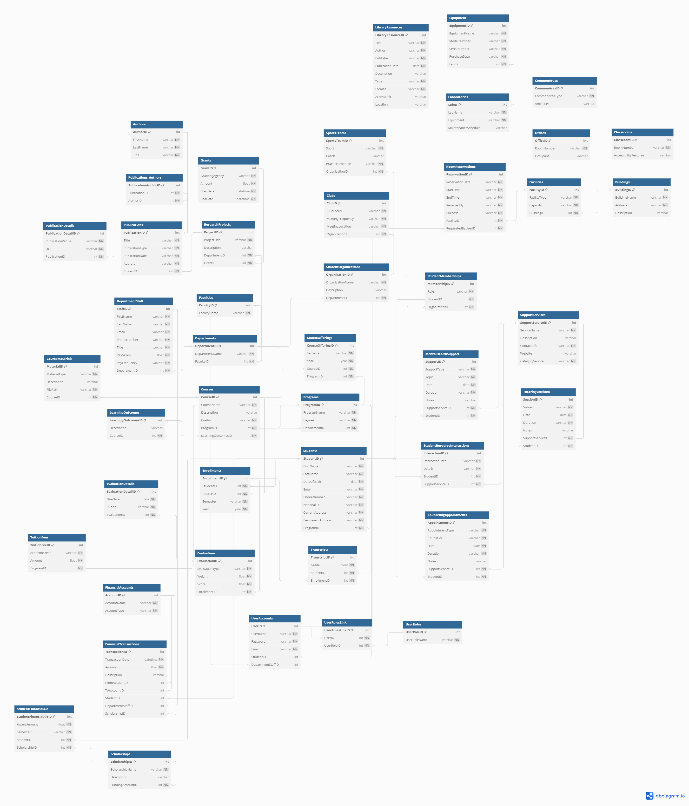

# Academic-Institution-Database-Design
Academic Institution Database, Database Design, Schema

# Introduction and Overview of the database design
My database meets the needs of storing and managing a large amount of data for a famous university in Vietnam.

The university offers undergraduate and graduate programs across numerous departments.
Each department houses a faculty body comprising professors, lecturers, and teaching assistants.
These faculty members conduct a variety of courses, each of which has a set of learning outcomes, a syllabus, and a grading scheme.
Students can enroll in multiple courses per semester and are evaluated based on their performance in assignments, quizzes, exams, and projects.

In addition to teaching, faculty members are actively engaged in research.
They lead research projects, sometimes funded by external grants, and produce publications such as journal articles, conference papers, and books.

The university offers resources such as tutoring services, career counseling, and mental health support.
The university tracks student interactions with these resources to better understand and meet their needs.

The university library offers a vast collection of books, journals, and digital resources, all of which are cataloged and available for students and faculty.

Students can participate in student organizations, clubs and sports teams at the university.

The university's facilities include multiple buildings, classrooms, laboratories, offices, and common areas.

The university manages finances including tuition, scholarships for students and payroll for faculty and staff.
The university keeps detailed records of all financial transactions.

# The Entity Relationship Diagram (ERD)
